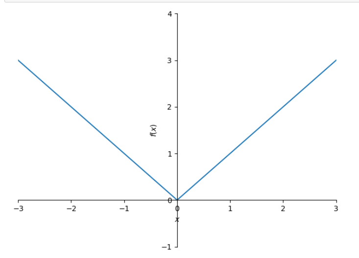
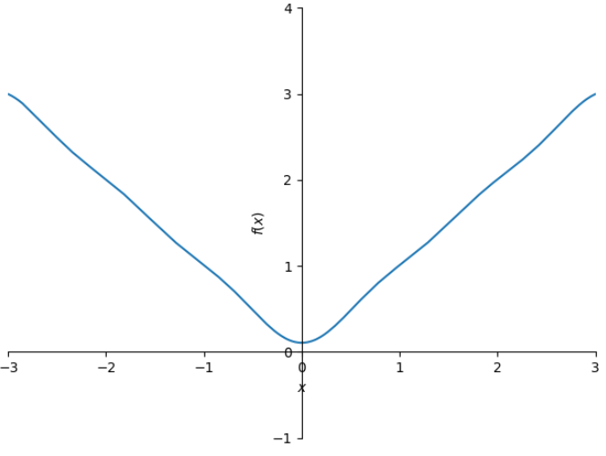

---
title: "Computações com Python III"
number-sections: true
lang: pt-BR
--- 

## O espaço de funções analíticas

Sejam $a,b\in\R$ com $a<b$ e considere e espaço vetorial $C^\infty[a,b]$ de funções analíticas no intervalo $[a,b]$. O espaço $C^\infty[a,b]$  é espaço com produto interno onde o produto interno para $f,g\in C^\infty[a,b]$ é definido como 
$$
\left<f,g\right>=\int_a^b fg\, dx.
$${#eq-prod-int-int}
Hoje, nós vamos fazer algumas computações no espaço $C^\infty[a,b]$.


:::{#exm-ip-int}
Ponha, por exemplo, $a=-1$, $b=1$. Vamos verificar que as funções $f(x)=x$ e $g(x)=x^2$ são ortogonais. 
```python
from sympy import integrate, var, cos, sin, pi, Integral, plot
x = var('x')
f, g = x, x**2
integrate( f*g, (x,-1,1))
0
```
:::
Observe como a função [`integrate`](https://docs.sympy.org/latest/modules/integrals/integrals.html) está usada para calcular a integral.

:::{#exr-ip-int1}
Escreva uma função `inner_product(f, g, var, a, b)` que devolve o produto interno das funções $f$ e $g$ sobre o intervalo $[a,b]$. A sua função deve verificar os seguintes valores.
```python
inner_product( x, x**2, x, -1, 1 )
0
inner_product( 1, x**2, x, -1, 1 )
2/3
inner_product( cos(x), sin(x), x, -pi, pi )
0
inner_product( cos(x), cos(x), x, -pi, pi )
pi
```
:::

:::{#exr-proj-ort}
Escreva uma função `orthogonal_projection(f, g, var, a, b)` para calcular a projeção ortogonal de $f$ sobre $g$ (@prp-proj-ort) considerando o 
produto interno na @eq-prod-int-int. Use a função `inner_product` que escreveu no @exr-ip-int1. A sua implementação deve verificar as seguintes computações. 
```python
orthogonal_projection( x, x**2, x, -1, 1 )
0
orthogonal_projection( 1, x**2, x, -1, 1 )
5x^2/3
orthogonal_projection( x**2, cos(x), x, -pi, pi )
-4*cos(x)
```
::: 

## Ortogonalização de Gram-Schmidt


O processo de ortogonalização  de Gram-Schmidt está descrita na demonstração do @thm-gram-sch. Vamos revisar o processo aqui rapidamente. Assuma que $v_1,\ldots,v_n$ é um sistema L.I. em um espaço vetorial $V$ com produto interno. Defina os vetores $w_1,\ldots,w_n$ da seguinte forma:
\begin{align*}
w_1&=v_1;\\
w_2&=v_2-\mbox{proj}_{w_1}(v_2);\\
w_3&=v_3-\mbox{proj}_{w_1}(v_3)-\mbox{proj}_{w_2}(v_3);\\
&\vdots\\
w_n&=v_n-\mbox{proj}_{w_1}(v_n)-\mbox{proj}_{w_2}(v_n)-\cdots-\mbox{proj}_{w_{n-1}}(v_n).
\end{align*}
Então o sistema $w_1,\ldots,w_n$ é ortogonal e os subespaços $\left<v_1,\ldots,v_i\right>$, $\left<w_1,\ldots,w_i\right>$ são iguais para todo $i\in\{1,\ldots,n\}$. 


:::{#exr-gram-sch}
Escreva uma função `gram_schmidt(funcs, var, a, b)` que, dada uma lista `funcs` de funções (assumindo que elas são L.I.), aplica o processo de ortogonalização de Gram-Schmidt para esta lista.  A sua função deve verificar as seguintes computações. 
```python
gram_schmidt([1,x,x**2], x, -1, 1)
[1, x, x**2 - 1/3]
gram_schmidt([1,x,x**2], x, 0, 1)
[1, x - 1/2, x**2 - x + 1/6]
gram_schmidt([1,cos(x),sin(x)], x, -pi, pi)
[1, cos(x), sin(x)]
```
**Dica:** Cria uma lista `ws` para guardar as funções $w_1,\ldots,w_n$. Assumindo que as funções $w_1,\ldots,w_{k}$ foram calculadas e estão na lista `ws`, o próximo elemento de `ws` pode ser calculado com 
```python
f - sum(orthogonal_projection(f, w, var, a, b) for w in ws)
```
onde `f` é o elemento atual de `funcs`.
:::

:::{#exr-gram-sch1}
Usando a função `gram_schmidt` no @exr-gram-sch, calcule uma base ortogonal para o espaço $\R_4[x]$ considerando o produto interno 
na @eq-prod-int-int sobre o intervalo $[-1,1]$ e sobre o intervalo $[0,1]$. Verifique com a função `inner_product` escrita no @exr-ip-int1 que as funções no output são de fato ortogonais.
:::

## As séries de Fourier

Para calcular as séries de Fourier de algumas funções como no @thm-fourier, vamos primeiro aprender como calcular integrais numericamente. 

```python
integrate( cos(x)*sin(x), (x, -2, 1))
-sin^2(2)/2+sin(1)/2
integrate( cos(x)*sin(x), (x, -2, 1)).evalf()
-0.0593741960791174
Integral(cos(x)*sin(x),(x,-2,1))
...integral object...
Integral( cos(x)*sin(x), (x, -2, 1)).evalf()
-0.0593741960791174
```
Consulte o [manual](https://docs.sympy.org/latest/modules/evalf.html#sums-and-integrals) para mais informações.

:::{#exr-in-prod-num}
Modifique a sua implementação do produto interno e projeção ortogonal no @exr-ip-int1 e no @exr-proj-ort tal que elas devolvam 
aproximações numéricas em vez de valores exatos. 
:::

:::{#exr-fourier}
Escreva uma função `fourier(f)` em Python que dada uma função $f\in C^\infty[a,b]$, calcula a aproximação de Fourier para a função $f$ até grau $5$. Use a função `orthogonal_projection` modificada no @exr-in-prod-num. A sua função deve verificar as seguintes computações.
```python
fourier(x)
2.0*sin(x)-1.0*sin(2*x)+0.666666666666667*sin(3*x)-0.5*sin(4*x)+0.4*sin(5*x)
fourier(x**2)
-4.0*cos(x)+1.0*cos(2*x)-0.444444444444444*cos(3*x)+0.25*cos(4*x)-0.16*cos(5*x)+3.28986813369645
fourier(abs(x))
-1.27323954473516*cos(x)-0.141471060526129*cos(3*x)-0.0509295817894065*cos(5*x)+1.5707963267949
```
:::

:::{#exr-fourier}
Verifique visualmente a qualidade destas aproximações. Por exemplo 
```python
f = abs(x)
plot(f, xlim=(-3,3), ylim=(-1,4))
```

```python
ff = fourier(f)
plot(ff, xlim=(-3,3), ylim=(-1,4))
```


1. Faça a mesma coisa com outras funções, tais como $x$, $x^2$, $\exp(x)$, etc. 
2. Modifique a sua função `fourier` tal que seja capaz de calcular as aproximações até grau $10$ ou até um grau $k$ arbitrário fornecido pelo usuário. 
3. Verifique se a qualidade das aproximações melhora assim que $k$ aumenta. 
:::