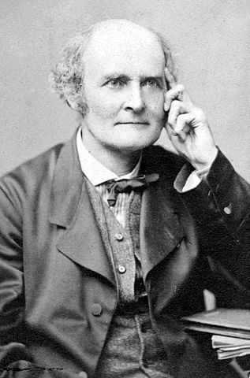

## Ações de grupos

:::{#def-action}
Seja $G$ um grupo e $\Omega$ um conjunto. Dizemos que $G$ age em $\Omega$ se está dada uma função
$$
\Omega\times G\to \Omega,\quad (\omega,g)\mapsto \omega g
$$
com as seguintes propriedades:

* $\alpha 1=\alpha$ para todo $\alpha\in\Omega$;
* $\alpha(gh)=(\alpha g)h$ para todo $\alpha\in \Omega$, $g,h\in G$.

Se $\alpha\in\Omega$, o elemento $\alpha g$ é dito imagem de $\alpha$ por $g$.
:::

:::{#exm-action}
Os exemplos apresentamos ações importantes de grupos. O leitor deve verificar que cada item define uma ação.

1. Seja $G\leq\mbox{Sym}(\Omega)$. Neste caso $G$ é dito um grupo de permutação sobre $\Omega$. O grupo  $G$ age naturalmente em $\Omega$.
2. Seja $G=D_4$ e $\Omega$ o conjunto das quatro pontas no quadrado. O grupo $G$ age em $\Omega$ naturalmente.
3. Seja $G\leq \GL n\F$ e $\Omega=\F^n$. O grupo $G$ age em $\Omega$ pela ação $(v,g)\mapsto vg$ para todo $v\in \F^n$ e $g\in G$.
4. Seja $G\leq \GL n\F$ e seja $\Omega=\{\left<v\right>\mid v\in \F^n\setminus\{0\}\}$. O conjunto $\Omega$ é chamado de espaço projetivo. O grupo $G$ age em $\Omega$ e a ação é $(\left<v\right>,g)\mapsto \left<vg\right>$ para todo $v\in \F^n$ e $g\in G$.
5. Seja $G$ um grupo arbitrário e seja $\Omega=G$. O grupo $G$ age em $\Omega$ pela ação $(x,g)\mapsto xg$ para todo $x\in \Omega$ e $g\in G$.
6. Sejam $G$ um grupo $H\leq G$ e $\Omega=\{Hg\mid g\in G\}$. O grupo $G$ age em $\Omega$ e a ação é $(Hx,g)\mapsto Hxg$ para todo $Hx\in\Omega$ e $g\in G$.
7. Seja $G$ um grupo e ponha $\Omega=G$. Então $G$ age em $\Omega$ pela ação de conjugação: $(x,g)\mapsto x^g=g^{-1}xg$.
:::

:::{#lem-action-hom}
Assuma que $G$ age em $\Omega$. Para $g\in G$, o mapa $\pi_g:\alpha\mapsto \alpha g$ é uma permutação de $\Omega$; ou seja, $\pi_g\in\sym\Omega$. Além disso, o mapa $G\to \sym\Omega$, $g\mapsto \pi_g$ é um homomorfismo. Reciprocamante, se $\psi:G\to \sym\Omega$ é um homomorfismo, então o mapa $\Omega\times G\to \Omega$, $(\alpha,g)\mapsto \alpha (g\psi)$ é uma ação de $G$ em $\Omega$.  
:::
:::{.proof}
Exercício.
:::

## O Teorema de Cayley

Considere o item 5. no @exm-action. Ou seja, $G$ age no conjunto $G$ por multiplicação $(x,g)\mapsto xg$ (essa ação de $G$ em $G$ é chamada de *ação regular à direita* de $G$). Pelo @lem-action-hom, obtemos um homomorfismo $\psi:G\to\sym G$. Este homomorfismo é injetivo, pois se $g\in\ker\psi$, então $\psi(g)=\mbox{id}_G$ e $xg=x\psi(g)=x$ para todo $x\in G$ que implica que $g=1$. Logo $\ker\psi=1$ e $\psi$ é injetivo. Portanto 
$$
G\cong\mbox{Im}(\psi)\leq \sym G.
$$ 
Ou seja, $G$ é isomorfo a um grupo de permutação sobre o conjunto $G$. 

Assim obtemos o famoso [Teorema de Cayley](https://pt.wikipedia.org/wiki/Teorema_de_Cayley).

.

:::{#thm-cayley}
(O Teorema de Cayley)
Todo grupo isomorfo a um grupo de permutação.
:::

## Órbitas e transitividade 

:::{#def-orbit}
Assuma que $G$ age em $\Omega$. Defina a seguinte relação $\equiv$ sobre $\Omega$. Se $\alpha,\beta\in\Omega$ então $\alpha\equiv\beta$ se existe $g\in G$ tal que $\alpha g=\beta$.
:::

:::{#exr-orbit}
A relação $\equiv$ é uma equivalência.
:::

As classes de equivalência da relação $\equiv$ são chamadas de órbitas. Se $\alpha\in\Omega$, então por definição, a órbita que contém $\alpha$ é o conjunto
\begin{eqnarray*}
\alpha G&:=&\{\beta\in\Omega\mid \alpha\equiv \beta\}\\&=&
\{\beta\in\Omega\mid \beta=\alpha g\mbox{ com algum $g\in G$}\}\\&=&
\{\alpha g\mid g\in G\}.
\end{eqnarray*}

Se $G$ age em $\Omega$, então as órbitas de $G$ em $\Omega$ formam uma partição de $\Omega$.

:::{#exm-orbit}
Assuma que $G=\GL n\F$ e considere a ação de $G$ em $\Omega=\F^n$. Então $G$ tem duas órbitas em $\Omega$; nomeadamente, $\{0\}$ e $\Omega\setminus\{0\}$.
:::

:::{#def-transitive}
O grupo $G$  é dito transitivo em $\Omega$ se $\Omega$ é uma órbita de $G$. Equivalentemente, $G$ é transitivo em $\Omega$, se para todo $\alpha,\beta\in\Omega$, existe $g\in G$ tal que $\alpha g=\beta$.
:::

:::{#exm-transitive}
Seja $G=\GL n\F$ e considere a ação de $G$ sobe o espaço projetivo $\{\left<v\right>\mid v\in \F^n\setminus\{0\}\}$. O grupo $G$ é transitivo sobre $\Omega$.
:::

## O estabilizador

:::{#def-stab}
Dado $\alpha\in\Omega$, definimos o estabilizador de $\alpha$ em $G$ como
$$
G_\alpha=\{g\in G\mid \alpha g=\alpha\}.
$$
:::

:::{#exr-stab}
$G_\alpha$ é um subgrupo de $G$.
:::

:::{#exm-orbits}
Considere a ação de $G=\GL n \F$ sobre $\Omega=\{\left<v\right>\mid v\in\F^n\setminus\{0\}\}$. Seja $\alpha=\left<(1,0,\ldots,0)\right>$. Então o estabilizador $G_\alpha$ é o subgrupo de matrizes na forma
$$
\begin{pmatrix} a & \underline 0\\ \underline u & B\end{pmatrix}
$$
onde $a\in\F\setminus\{0\}$, $\underline 0\in\F^{n-1}$ é o vetor nulo, $\underline u\in\F^{n-1}$ e $B$ é uma matriz $(n-1)\times(n-1)$ invertivel.
:::

## O Teorema Órbita-Estabilizador{#sec-thm-os}

Assuma que $\Omega$, $G$, e $\alpha\in\Omega$ são como acima. Para $\beta\in \alpha G$, considere o conjunto
$$
G_{\alpha\to\beta}=\{g\in G\mid \alpha g=\beta\}.
$$

Observações. 

* $G_{\alpha\to\alpha}=G_{\alpha}$ é um subgrupo de $G$.
* Como $\beta\in \alpha G$, o conjunto $G_{\alpha\to\beta}\neq\emptyset$.
* Seja $g\in G_{\alpha\to\beta}$ e $h\in G_\alpha$. Então
$$
\alpha(hg)=(\alpha h)g=\alpha g=\beta.
$$
Ou seja, $hg\in G_{\alpha\to \beta}$. Isto quer dizer que a classe lateral $G_\alpha g$ está contido em $G_{\alpha\to\beta}$.
* Seja $x$ um outro elemento de $G_{\alpha\to\beta}$. Então
$$
\alpha (xg^{-1})=(\alpha x)g^{-1}=\beta g^{-1}=\alpha.
$$
Ou seja $xg^{-1}\in G_\alpha$, ou seja $x\in G_\alpha g$. Isto implica que $G_{\alpha\to\beta}\subseteq G_\alpha g$.

As duas observações anteriores implicam que $G_{\alpha\to\beta}=G_{\alpha}g$ onde $g\in G$ tal que $\alpha g=\beta$.  Ou seja, o conjunto $G_{\alpha\to\beta}$ é uma classe lateral de $G_\alpha$. Em particular, esta correspondência dá uma aplicação 
$$
\varphi:\alpha G\to \{G_\alpha g\mid g\in G\},\quad \beta\mapsto G_\alpha g \quad\mbox{com}\quad g\in G_{\alpha\to\beta}.
$$

:::{#thm-orbit-stab}
(Teorema Órbita-Estabilizador V1)
Usando a notação introduzida acima, a aplicação $\varphi:\alpha G\to \{G_\alpha g\mid g\in G\}$ está bem definida e ela é uma bijeção entre $\alpha G$ e $\{G_\alpha g\mid g\in G\}$.
:::

:::{.proof}
Boa definição: Assuma que $g_1,g_2\in G$ tais que $\alpha g_1=\alpha g_2=\beta$. Então $g_1g_2^{-1}\in G_\alpha$ e isto implica que $G_\alpha g_1=G_\alpha g_2$. Logo, a aplicação $\varphi$ está bem definida.

Sobrejetiva: Se $G_\alpha g$ é uma classe lateral de $G_\alpha$, então $G_\alpha g=\varphi(\alpha g)$.

Injetiva: Assuma que $\beta_1,\beta_2\in \Omega$ tais que $\varphi(\beta_1)=\varphi(\beta_2)$. Então existem $g_1,g_2\in G$ tais que $\beta_1=\alpha g_1$ e $\beta_2=\alpha g_2$. Mas pela definição de $\varphi$,
$$
G_\alpha g_1=\varphi(\alpha g_1)=\varphi(\beta_1)=\varphi(\beta_2)=\varphi(\alpha g_2)=G_\alpha g_2.
$$
Ou seja, $g_1g_2^{-1}\in G_\alpha$. Mas isto implica que $\alpha g_1g_2^{-1}=\alpha$ e que $\beta_1=\alpha g_1=\alpha g_2=\beta_2$. Portanto o mapa $\varphi$ é injetivo.
:::

:::{#cor-orbit-stab}
(Teorema Órbita-Estabilizador V2) Assuma que um grupo finito $G$ age transitivamente em um conjunto $\Omega$ e seja $\alpha\in\Omega$. Então $|G|=|G_\alpha||\Omega|$. Em particular $|\Omega|$ é um divisor de $|G|$.
:::

## Aplicações do Teorema Órbita-Estabilizador

Nos seguintes exemplos apresentaremos duas aplicações importantes 

:::{#exm-cent}
(O centralizador)
Observamos no @exm-action que a conjugação é uma ação de $G$ sobre $G$. Mais precisamente, considere a ação 
$$
G\times G\to G,\quad (x,g)\mapsto x^g=g^{-1}xg.
$$
A órbita de $x\in G$ é o conjunto 
$$
\{x^g\mid g\in G\}=\{g^{-1}xg\mid g\in G\}.
$$ 
Este conjunto chama-se a *classe de conjugação* de $x$ em $G$ e será denotado por $x^G$.  Se $G\neq 1$, então esta ação é intransitiva, pois $\{1\}$ é uma órbita. O estabilizador de $x$ por esta ação é o subgrupo 
$$
G_x=\{g\in G\mid g^{-1}xg=x\}=\{g\in G\mid xg=gx\}.
$$
Ou seja, o estabilizador $G_x$ de $x$ é o conjunto de elementos de $G$ que comutam com $x$. Este conjunto chama-se o *centralizador de $x$ em $G$* e é denotado por $C_G(x)$. 

Se $G$ for um grupo finito e $x\in G$, então o Teorema Órbita-Estabilizador implica que 
$$
|x^G|=|G|/|C_G(x)|.
$$
:::

:::{#exm-norm}
(Normalizador) 
Considere um grupo $G$ e considere $\mathcal H$ o conjunto dos subgrupos de $G$. Então $G$ age em $\mathcal H$ por conjugação na seguinte forma:
$$
(H,g)\mapsto H^g=g^{-1}Hg.
$$
É fácil verificar que $H^g\leq G$ sempre que $H\leq H$ e $g\in G$. Ora, a órbita de $H\in\mathcal H$ é o conjunto 
$$
H^G=\{H^g\mid g\in G\}
$$
que chama-se a *classe de conjugação do subgrupo $H$ em $G$*. O estabilizador de $H$ em $G$ é o subgrupo 
$$
\{g\in G\mid H^g=H\}=\{g\in G\mid g^{-1}Hg=H\}.
$$
Este subgrupo chama-se *normalizador de $H$ em $G$* e está denotado por $N_G(H)$. O normalizador pode ser visto como o maior subgrupo $N$ de $G$ tal que $H$ é normal em $N$. 

Se $G$ for finito e $H\leq G$, o Teorema Órbita-Estabilizador nos diz que 
$$
|H^G|=|G|/|N_G(H)|.
$$
:::

## Blocos

:::{#def-block}
Assuma que $G$ age transitivamente em $\Omega$. Um conjunto $\Delta\subseteq \Omega$ é dito bloco se $\Delta g=\Delta$ ou $\Delta g\cap\Delta=\emptyset$ para todo $g\in G$.  Uma partição $\mathcal P$ de $\Omega$ é dito $G$-invariante se $\Delta g\in \mathcal P$ para todo $\Delta\in \mathcal P$.
:::

:::{#lem-blocks}
Assuma que $G$ age em $\Omega$ transitivamente. As seguintes são verdadeiras.

* Se $\Delta$ é um bloco então $\mathcal P=\{\Delta g\mid g\in G\}$ é uma partição  $G$-invariante de $\Omega$.
* Se $\mathcal P$ é uma partição $G$ invariante de $\Omega$ e $\Delta\in\mathcal P$, então $\Delta$ é um bloco.
* Seja $\omega\in\Omega$ fixo. O mapa $\Delta\mapsto \{\Delta g\mid g\in G\}$ é uma bijeção entre o conjunto de blocos $\Delta$ tal que $\omega\in\Delta$ e o conjunto de partições $G$-invariantes de $G$.
:::

:::{.proof}
Exercício.
:::

:::{#def-primitive}
Se $G$ age em $\Omega$ transitivamente e $\omega\in\Omega$, então $\{\omega\}$ e $\Omega$ são blocos. Similarmente $\{\{\omega\}\mid\omega\in\Omega\}$ e $\{\Omega\}$ são partições $G$-invariantes. Um grupo transitivo é dito primitivo se estes são os únicos blocos. No caso contrario o grupo e chamado de imprimitivo.
:::

## Grupos primitivos

Assuma que $G$ age transitivamente em $\Omega$ e seja $\omega\in\Omega$ fixo. Se $\Delta$ é um bloco tal que $\omega\in\Delta$, então denota por $G_\Delta$ o estabilizador de $\Delta$ em $G$. Se $H\leq G$ tal que $G_\omega\leq H$, então denote por $\omega H$ a $H$-órbita que contém $\omega$.

:::{#thm-primitive}
As seguintes são verdadeiras.

* Se $\Delta$ é um bloco tal que $\omega\in\Delta$, então $G_\omega \leq G_\Delta\leq G$.
* Se $H$ é um subgrupo de $G$ tal que $G_\omega\leq H$, então $\Delta=\omega H$ é um bloco tal que $\omega\in\Delta$.
* Se $\Delta$ é um bloco tal que $\omega\in\Delta$, então $\omega G_\Delta=\Delta$. Se $H\leq G$ tal que $G_\omega\leq H$, então $G_{\omega H}=H$. Em particular os mapas $\Delta\mapsto G_\Delta$ e $H\mapsto \omega H$ são bijeções entre o conjunto de blocos $\Delta$ tal que $\omega\in\Delta$ e o conjunto de subgrupos $H$ tal que $G_\omega\leq H$.
:::

:::{.proof}
1. Claramente, $G_\Delta\leq G$. Seja $g\in G_\omega$. Então $\omega\in \Delta\cap \Delta g$, e assim $\Delta g=\Delta$. Logo $G_\omega\leq G_\Delta$.

2. Sejam  $\Delta=\omega H$, $g\in G$ e $\alpha\in\Omega$ tais que $\alpha \in \Delta\cap \Delta g=\omega H\cap \omega Hg$. Então existem $h_1,h_2\in H$ tais que $\alpha=\omega h_1=\omega h_2g$. Portanto, $\omega h_2gh_1^{-1}=\omega$, e $h_2gh_1^{-1}\in G_\omega$. Como $h_1,h_2\in H\geq G_\omega$, obtemos que $g\in H$ que implica que $\Delta g=\omega Hg=\omega H=\Delta$.

3. Seja $\Delta$ um bloco tal que $\omega\in \Delta$ e seja $H=G_\Delta$. Afirmamos que $\omega H=\Delta$. Se $h\in H$, então $\omega h\in \Delta$ pela definição de $H$. Portanto $\omega H\subseteq \Delta$. Se $\delta\in\Delta$, então existe um $g\in G$ tal que $\omega g=\delta$. Neste caso, $\delta=\omega g\in \Delta\cap \Delta g$ que implica que $g\in G_\Delta$. Logo $\delta\in \omega H$.  Logo $\Delta\subseteq \omega H$ e obtemos a igualdade $\Delta= \omega H$. Seja agora $H\leq G$ tal que $G_\omega\leq H$ e seja $\Delta=\omega H$. Afirmamos que $H=G_\Delta$. Se $h\in H$ e $\delta\in \Delta$, então $\delta h=\omega gh\in\Delta$ com $g\in H$. Portanto $H\subseteq G_\Delta$. Se $g\in G_\Delta$, então $\omega g\in\Delta$ e $\omega g=\omega h$ com $h\in H$. Logo $\omega gh^{-1}=\omega$ e $gh^{-1}\in G_\omega$. Como $G_\omega\leq H$, tem-se que $gh^{-1}\in H$ e $g\in H$. Portanto $G_\Delta\leq H$ e $G_\Delta=H$.
:::

:::{#exr-primitive}
Assuma que $G$ age em $\Omega$ transitivamente, seja $\alpha\in\Omega$ e seja $H\leq G$. Então $H$ é transitivo se e somente se $G_\alpha H=G$.
:::

:::{#cor-primitive-max}
Seja $G$ um grupo transitivo agindo em $\Omega$ e seja $\omega\in\Omega$. Então $G$ é primitivo se e somente se $G_\omega$ é um subgrupo maximal.
:::

:::{#def-2-trams}
Um grupo $G$ agindo em $\Omega$ é dito 2-transitivo se  para todo $\alpha,\beta,\gamma,\delta\in\Omega$ com $\alpha\neq \beta$ e $\gamma\neq \delta$ existe $g\in G$ tal que $\alpha g=\gamma$ e $\beta g=\delta$.
:::

:::{#exr-2-trans}
Demonstre que um grupo 2-transitivo é primitivo. Demonstre que $S_n$, $A_n$, $\operatorname{PSL}(n,q)$. $\operatorname{PGL}(n,q)$ são 2-transitivos e portanto primitivos.
:::