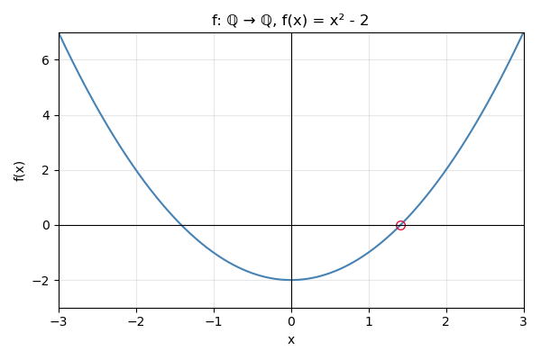

## Os números inteiros. 

Nas aulas anteriores, construímos os números naturais. Agora, vamos construir os números inteiros.

Tendo construído os números naturais, já possuímos a "metade" dos inteiros; isto é, já temos os números positivos. A ideia para construir os números negativos e o zero é considerar um número inteiro geral como uma diferença formal "$a-b$" de números naturais $a,b\in\N$. O problema com essa abordagem é que a subtração não está sempre definida entre os naturais, pois $\N$ não é fechado para a operação $-$. Para resolver este problema, identificamos a diferença formal "$a-b$" com o par ordenado $(a,b)\in\N\times\N$. Por exemplo, o número "menos dois" será identificado com $(1,3)$ (pois $-2=1-3$). 

Entretanto, surge outro problema: vários pares ordenados podem representar o mesmo número inteiro. Por exemplo, $(1,3)$, $(2,4)$, $(3,5)$, etc., todos representam o número "menos 2", já que $1-3=2-4=3-5=\cdots=-2$. A solução para este problema é utilizar o conceito de relação de equivalência e considerar estes pares como equivalentes. Assim, cada número inteiro será representado por uma classe de equivalência de pares ordenados de números naturais.

A implementação formal da ideia informal do parágrafo anterior é a seguinte. Considere o conjunto $\N\times\N$ e considere a relação $\sim$ sobre $\N\times\N$ definida como 
$$
(a,b)\sim (c,d)\quad\mbox{quando}\quad a+d=b+c.
$$

:::{#lem-rel-int}
A relação $\sim$ é uma relação de equivalência. 
:::
:::{.proof}
Consulte o @exr-ntimesn
:::

Seja $(a,b)\in\N\times \N$. A classe de equivalência de $(a,b)$ será denotada por $[a,b]$. Por exemplo:
\begin{align*}
[1,1]&=\{(1,1),(2,2),(3,3),\ldots\}\\
[2,1]&=\{(2,1),(3,2),(4,3),\ldots\}\\
[1,2]&=\{(1,2),(2,3),(3,4),\ldots\}
\end{align*}

Observe que a classe $[1,1]$ contém os pares da forma $(a,a)$; ou seja, pares com ambos os componentes iguais. A classe $[2,1]$ contém os pares da forma $(a+1,a)$; isto é, pares onde o primeiro componente é uma unidade maior que o segundo. A classe $[1,2]$ contém os pares da forma $(a,a+1)$, onde o segundo componente é uma unidade maior que o primeiro. 

Em geral, temos uma classe da forma 
$$
[1,1]=\{(a,a)\mid a\in\N\},
$${#eq-pair-zero}
e as demais classes têm a forma 
$$
[1+k,1]=\{(a+k,a)\mid a\in \N\}
$${#eq-pair-pos}
ou 
$$
[1,1+k]=\{(a,a+k)\mid a\in \N\}.
$${#eq-pair-neg}

A ideia por trás da construção dos números inteiros é que a classe descrita em @eq-pair-pos pode ser identificada com o número natural $k\in\N$, a classe em @eq-pair-zero representa o zero, e a classe em @eq-pair-neg representa o oposto (negativo) de $k$.

:::{#def-int}
Um número inteiro é uma classe de equivalência $[a,b]$ para a relação $\sim$. O conjunto dos inteiros é denotado por $\mathbb Z$. 
:::

## As operações entre números inteiros

:::{#def-int-ops}
Definimos as operações de $+$ e $\cdot$ entre elementos de $\Z$:

1. $[a,b]+[c,d]=[a+c,b+d]$;
2. $[a,b][c,d]=[ac+bd,ad+bc]$.
:::

:::{#lem-int-ops}
As operações $+$ e $\cdot$ são bem definidas; ou seja, o resultado não depende da escolha do representate da classe. Além disso, temos as seguintes propriedades para todo $x,y,z\in\Z$:

1. $(x+y)+z=x+(y+z)$;
2. $x+y=y+x$;
3. Existe elemento neutro para a soma. Nomeadamente, denotando $0=[1,1]$, temos que $x+0=0+x=x$;
4. $x$ possui negativo $-x$ que satisfaz $x+(-x)=0$;
5. $0\cdot x=0$; 
6. $(xy)z=x(yz)$;
7. $xy=yx$;
8. Existe elemento neutro para o produto. Nomeadamente, denotando $1_{\Z}=[2,1]$, temos que $1_{\Z}x=x1_{\Z}=x$;
9. $x(y+z)=xy+xz$;
10. se $x+z=y+z$, então $x=y$;
11. se $xz=yz$ e $z\neq 0$, então $x=y$.
:::

:::{.proof}
Primeiro provaremos que as operações são bem definidas. Demonstramos isso para o produto, pois a soma é mais simples 
e o leitor poderá fazer. Assuma que $[a,b]=[a',b'],[c,d]\in\Z$. Precisa provar que o produto $[a,b][c,d]$ pode 
ser calculada também como $[a',b'][c,d]$ e o resultado vai ser o mesmo. De fato,
$$
[a,b][c,d]=[ac+bd,ad+bc]
$$
e
$$
[a',b'][c,d]=[a'c+b'd,a'd+b'c].
$$
Para provar que estes dois números são os mesmos, precisa verificar que 
$$
ac+bd+a'd+b'c=ad+bc+a'c+b'd.
$${#eq-prod-ver}
Como $[a,b]=[a',b']$, temos que $a+b'=a'+b$. Logo, 
$$
ac+bd+a'd+b'c=(a+b')c+(b+a')d=(a'+b)c+(a+b')d=ad+bc+a'c+b'd
$$
e a @eq-prod-ver está verificada. Pode provar com argumento similar, que se 
$[a,b],[c,d]=[c',d']\in\Z$, então $[a,b][c,d]=[a,b][c',d']$. 

Note que no ponto 4., o inverso de $x=[x_1,x_2]$ é $[x_2,x_1]$. De fato, 
$$
[x_1,x_2]+[x_2,x_1]=[x_1+x_2,x_2+x_1]=0.
$$

As demais afirmações são fáceis de provar usando as propriedades já provadas dos números naturais. 
Para ilustrar a técnica, vamos provar o  item 9. e o item 10. O resto é exercício para o leitor. 

Assuma que $x=[x_1,x_2]$, $y=[y_1,y_2]$, $z=[z_1,z_2]$ e vamos computar que 
\begin{align*}
x(y+z)&=[x_1,x_2]([y_1,y_2]+[z_1,z_2])=[x_1,x_2]([y_1+z_1,y_2+z_2])\\&=
[x_1(y_1+z_1)+x_2(y_2+z_2),x_1(y_2+z_2)+x_2(y_1+z_1)]\\&=
[x_1y_1+x_1z_1+x_2y_2+x_2z_2,x_1y_2+x_1z_2+x_2y_1+x_2z_1].
\end{align*}
Por outro lado, 
\begin{align*}
xy+xz&=[x_1,x_2][y_1,y_2]+[x_1,x_2][z_1,z_2]\\&=[x_1y_1+x_2y_2,x_1y_2+x_2y_1]+[x_1z_1+x_2z_2,x_1z_2+x_2z_1]\\&=
[x_1y_1+x_2y_2+x_1z_1+x_2z_2,x_1y_2+x_2y_1+x_1z_2+x_2z_1]
\end{align*}

Sejam $x=[x_1,x_2]$, $y=[y_1,y_2]$, $z=[z_1,z_2]$ e assuma que 
$x+z=y+z$; ou seja, 
$$
[x_1+z_1,x_2+z_2]=[y_1+z_1,y_2+z_2].
$$
Logo, 
$$
x_1+z_1+y_2+z_2=x_2+z_2+y_1+z_1.
$$
Ora, usamos a lei cancelativa para números naturais e obtemos que 
$$
x_1+y_2=x_2+y_1;
$$
ou seja, $x=[x_1,x_2]=[y_1,y_2]=y$. 
:::

Como já foi observado acima, o número natural $k$ pode ser identificado com o inteiro $[k+1,1]\in\Z$. Sob essa identificação, as operações definidas em $\Z$ estendem as operações em $\N$. Por exemplo, se $k_1,k_2\in\N$, os inteiros correspondentes são $[k_1+1,1]$ e $[k_2+1,1]$, e sua soma é o inteiro associado a $k_1+k_2$:
$$
[k_1+1,1]+[k_2+1,1]=[k_1+k_2+2,2]=[k_1+k_2+1,1].
$$
A mesma observação vale para o produto; os detalhes ficam ao leitor.

## Ordenação entre números inteiros

:::{#lem-pre-ordering}
Denote por $P_{\Z}$ o conjunto 
$$
P_{\Z}=\{[a,b]\in\Z\mid a\geq b\}
$$ 
e ponha 
$$
-P_{\Z}=\{z\in\Z\mid -z\in P_{\Z}\}.
$$

1. $\Z=P_{\Z}\cup -P_{\Z}$ e $P_{\Z}\cap -P_{\Z}=\{0\}$;
2. se $a,b\in P_{\Z}$, então $a+b,ab\in P_{\Z}$;
3. se $a\in \Z$, então $a^2\in P_{\Z}$;
4. $-1\not\in P_{\Z}$.
:::

:::{.proof}
1. Se $z=[a,b]\in \Z$ com $a\geq b$, então $z\in P_{\Z}$. Se $z=[a,b]\in\Z$ com $a<b$, 
então $-z=[b,a]\in \Z$. Portanto $\Z=P_{\Z}\cup -P_{\Z}$.  Claramente, $0=[1,1]\in P_{\Z}\cap -P_{\Z}$. 
Se $z=[a,b]\in P_{\Z}\cap -P_{\Z}$, então $[a,b]\in P_{\Z}$ e $-[a,b]=[b,a]\in P_{\Z}$ e $a\geq b$ e $b\geq a$. 
A antissimetria da relação $\geq$ implica que $a=b$ e $z=[a,b]=[a,a]=0$. Portanto $P_{\Z}\cap -P_{\Z}=\{0\}$. 

Os demais itens ficam para exercício. 
:::

:::{#def-Z-ord}
Se $x,y\in\Z$, dizemos que $x\leq y$ se $y-x=y+(-x)\in P_{\Z}$. Em particular, se $x\in P_{\Z}$, então 
$0\leq x$ e se $x\in -P_{\Z}$, então $x\leq 0$. 
:::

:::{#lem-int-pos}
Sejam $x,y,z\in\Z$ As seguinte propriedades estão válidas. 

1. $x\leq x$;
2. se $x\leq y$ e $y\leq x$, então $x=y$;
3. se $x\leq y$ e $y\leq z$, então $x\leq z$; 
4. se $x\leq y$, então $x+z\leq y+z$; 
5. se $x\leq y$ e $z\geq 0$, então $xz\leq yz$;
6. se $x\leq y$ e $z\leq 0$, então $yz\leq xz$;
7. temos que exatamente uma das alternativas $x<y$ ou $x=y$ ou $y<x$ está válida.
:::
:::{.proof}
Estas afirmações seguem das afirmações do @lem-pre-ordering. 

1. Como $0=x-x\in P_{\Z}$, temos $x\leq x$. 
2. Se $x\leq y$ e $y\leq x$, então $y-x\in P_{\Z}$ e $x-y\in P_{\Z}$. A segunda afirmação implica que 
$-(x-y)=y-x\in -P_{\Z}$ e assim $y-x\in P_{\Z}\cap -P_{\Z}=\{0\}$. Portanto $y-x\in P_{\Z}$ e $y-x$. 
:::

O @lem-int-pos diz que a relação $\leq$ é uma relação de ordem total no conjunto $\Z$ que é compatível com  as operações.

## Os números racionais

A construção dos números racionais a partir dos inteiros é análoga à construção dos inteiros
a partir dos naturais. Pensamos um número racional como uma fração formal $a/b$, com $a\in\Z$ e $b\in\Z\setminus\{0\}$.
Como $\Z$ não é fechado para divisão, essa fração, em geral, não define um inteiro; por isso a representamos pelo par
ordenado $(a,b)\in\Z\times(\Z\setminus\{0\})$. Diferentes pares podem representar o mesmo valor (por exemplo, $1/2$
corresponde a qualquer um dos pares $(1,2)$, $(2,4)$, $(3,6)$, etc.). Para identificar tais pares, introduzimos
uma relação de equivalência em $\Z\times(\Z\setminus\{0\})$ e definimos os números racionais como as classes
de equivalência resultantes.

A seguir formalizamos essa estratégia e definimos as operações; como o procedimento é muito semelhante ao caso dos inteiros,
omitimos detalhes e deixamos as verificações ao leitor.

:::{#def-rat-rel}
Considere o conjunto $\Z\times\Z\setminus\{0\}$ e seja $\sim$ a relação em $\Z\times\Z\setminus\{0\}$ definida pela regra que 
$$
(a,b)\sim (c,d)\quad\mbox{quando}\quad ad=bc.
$$ 
:::

:::{#lem-rat-equiv}
A relação $\sim$ é uma relação de equivalência no conjunto $\Z\times\Z\setminus\{0\}$. Se $(a,b)\in\Z\times\Z\setminus\{0\}$, então a sua classe de equivalência será denotada por $[a,b]$. 
:::

:::{#def-rat}
Um número racional é uma classe de equivalência $[a,b]$. O conjunto dos números racionais é denotado por $\Q$. 
:::

:::{#def-rat-ops}
As operações $+$ e $\cdot$ serão definidas entre números racionais $[a,b],[c,d]\in\Q$ com as seguintes regras:
\begin{align*}
[a,b]+[c,d]&=[ad+cb,bd];\\
[a,b][c,d]&=[ac,bd].
\end{align*}
:::

:::{#lem-rat-ops}
As operações na @def-rat-ops são bem definidas; ou seja, o resultado não depende da escolha dos representantes das classes de equivalência. Além disso, elas satisfazem as seguintes propriedades para todo $a,b,c\in\Q$.

1.  $(a+b)+c=a+(b+c)$;
2.  $a+b=b+a$;
3.  existe $0_{\Q}\in\Q$ tal que $a+0_{\Q}=0_{\Q}+a=a$; 
4.  para todo $a\in\Q$ existe $-a\in\Q$ tal que $a+(-a)=0_{\Q}$;
5.  $(ab)c=a(bc)$;
6.  $ab=ba$;
7.  existe $1_{\Q}\in\Q$ tal que $a1_{\Q}=1_{\Q}a=a$; 
8.  para todo $a\in\Q\setminus\{0_{\Q}\}$ existe $a^{-1}\in\Q$ tal que $aa^{-1}=1_{\Q}$;
9.  $(a+b)c=ac+bc$.
10. $0a=0$.
:::
:::{.proof}
É tarefa do leitor. Só vamos comentar que $0_{\Q}=[0,1]$, $1_{\Q}=[1,1]$, se $a=[x,y]$, então $-a=[-x,y]$ e se $a\neq [0,1]$, então $a^{-1}=[y,x]$.
:::

Nós escrevemos o número racional $[x,y]$ como $x/y$. Os números $0_{\Q}$ e $1_{\Q}$ serão escritos simplesmente como $0$ e $1$. Note, para $k\in \Z$ que o número $[k,1]=k/1$ pode ser identificado com o inteiro $k$. Assim, podemos pensar os inteiros como números racionais e escrever que $\Z\subseteq\Q$. Se $a,b\in\Q$, então $a+(-b)$ será escrito como $a-b$ e $ab^{-1}$ será escrito como $a/b$.  

Entre os números racionais, podemos definir os números não negativos como 
$$
P_{\Q}=\{a/b\in \Q\mid a,b\geq 0\mbox{ e }b\neq 0\}
$$
e defina 
$$
-P_{\Q}=\{-x\mid x\in P_{\Q}\}.
$$

:::{#lem-qplus}
Temos que $P_{\Q}$ satisfaz as seguintes propriedades.

1. $\Q=P_{\Q}\cup -P_{\Q}$ e $P_{\Q}\cap -P_{\Q}=\{0\}$;
2. se $a,b\in P_{\Q}$, então $a+b,ab\in P_{\Q}$;
3. se $a\in \Q$, então $a^2\in P_{\Q}$;
4. $-1\not\in P_{\Q}$.
:::

:::{#def-order-q}
Defina para $a,b\in\Q$ a relação $a\leq b$ para significar que $b-a\in P_{\Q}$. 
:::

:::{#lem-order-q}
Temos que $\leq$ é uma ordem total no conjunto $\Q$. Ou seja, temos para todo $a,b,c\in\Q$, que 

1. $a\leq a$;
2. se $a\leq b$ e $b\leq a$, então $a=b$;
3. se $a\leq b$ e $b\leq c$, então $a\leq c$;
4. temos que ou $a\leq b$ ou $b\leq a$ vale.
   
Além disso, a relação $\leq$ é compatível com as operações. Ou seja, 

1. se $a\leq b$, então $a+c\leq b+c$;
2. se $a\leq b$ e $c\geq 0$, então $ac\leq bc$.
3. se $a\leq b$ e $c\leq 0$, então $bc\leq ac$. 
:::

## Os números reais

A construção dos números reais a partir dos racionais pode ser feita de várias maneiras. Uma das mais comuns é através de sequências de Cauchy ou cortes de Dedekind. 

<iframe width="560" height="315" src="https://www.youtube.com/embed/vsZXwUBuwO4?si=1mD8Q1tbR9zweMaY" title="YouTube video player" frameborder="0" allow="accelerometer; autoplay; clipboard-write; encrypted-media; gyroscope; picture-in-picture; web-share" referrerpolicy="strict-origin-when-cross-origin" allowfullscreen></iframe>

Aqui, vamos apenas assumir a existência dos números reais e suas propriedades básicas. 

Primeiro, devemos explicar porque os números racionais não são suficientes. Os problemas começam a surgir se tentamos 
calcular raízes. 

:::{#lem-sqrt2-not-rat}
Não existe nenhum número racional $x$ tal que $x^2=2$. 
:::
:::{.proof}
De fato, seja se $x=a/b$ com $a,b\in\N$, $b\neq 0$ e $x^2=2$. A expressão $a/b$ não é unica, mas existem 
$a,b\in\N$ tais que $a$ é mínimo possível, pela Princípio da Boa Ordem (@lem-N-well-ordered). Ora,
$$
\left(\frac{a}{b}\right)^2=2\implies a^2=2b^2.
$$ 
Logo, $a^2$ é par e assim $a$ é par. Escreva $a=2a_1$ com $a_1\in\N$. Ora, $a^2=4a_1^2$ e assim $4a_1^2=2b^2$, ou seja, $b^2=2a_1^2$. Logo, $b^2$ é par e assim $b$ é par e podemos escrever $b=2b_1$ com $b_1\in\N$. Ora, 
$$
x=\frac{a}{b}=\frac{2a_1}{2b_1}=\frac{a_1}{b_1}.
$$
Mas $a_1<a$ e isso contradiz a escolha de $a,b$, sendo $a$ mínimo possível. Portanto, não existe nenhum número racional $x$ tal que $x^2=2$.
:::

:::{#exm-sqrt2_triang}
Um problema imediato que surge trabalhando apenas com números racionais é que em um triângulo retângulo com catetos de comprimento $1$, o comprimento da hipotenusa não é um número racional. De fato, pelo Teorema de Pitágoras, o comprimento $c$ da hipotenusa satisfaz a equação
$$
c^2=1^2+1^2=2.
$$
Pelo @lem-sqrt2-not-rat, não existe nenhum número racional que satisfaz essa equação. Portanto, o comprimento da hipotenusa não é um número racional.
:::

:::{#exm-sqrt2}
Para explicar um outro problema mais sútil com racionais, considere por exemplo a função 
$$
f:\Q\to\Q,\quad f(x)=x^2-2.
$$
Note que $f(1)=-1<0$ e $f(2)=2>0$. Entretanto, não existe nenhum número racional entre $1$ e $2$ tal que $f(x)=0$,

{#fig-fx}

como mostra o @lem-sqrt2-not-rat. Ou seja, esta função não satisfaz o notável 
[Teorema do Valor Intermediário](https://pt.wikipedia.org/wiki/Teorema_do_valor_intermedi%C3%A1rio),
que diz que se uma função contínua $f:[a,b]\to\R$ satisfaz $f(a)<0$ e $f(b)>0$, então existe $c\in(a,b)$ tal que $f(c)=0$. 
O Teorema do Valor Intermediário é uma das propriedades fundamentais das funções reais e é está amplamente usado no 
estudo de funções nas áreas de Cálculo e Análise. 
:::

Os problemas acima são causadas pelos "buracos" nos números racionais. O termo técnico que descreve essa propriedade 
é que os números racionais não são completos. A completude dos números reais é uma 
propriedade fundamental que distingue os números reais dos racionais. Para expressar a propriedade de completude, precisamos 
algumas definições adicionais. 

:::{#def-bdd}
Seja $X$ um conjunto parcialmente ordenado (@def-ordem) e $A\subseteq X$. 

1. Dizemos que $A$ está **limitado superiormente** se existe $u\in X$ tal que $a\leq u$ para todo $a\in A$. O elemento $u$ é chamado de **cota superior** de $A$.
2. Seja $A\subseteq X$ limitado superiormnete. Dizemos que $s\in X$ é o **supremo** de $A$ se 

   a. $s$ é uma cota superior de $A$; e 
   b. se $u$ é qualquer outra cota superior de $A$, então $s\leq u$. 

O supremo de $A$ será denotado por $\sup A$.
:::

:::{#exm-supQ}
Seja $\Q$ o conjunto dos números racionais e considere o subconjunto 
$$
A=\{x\in\Q\mid x^2<2\}.
$$ 
O conjunto $A$ está limitado superiormente. Por exemplo, $2$ é uma cota superior de $A$, pois se $x\in A$, então $x^2<2<4$ e assim $x<2$. Na verdade, qualquer número racional maior ou igual a $\sqrt{2}$ é uma cota superior de $A$. Entretanto, o conjunto $A$ não possui supremo em $\Q$. De fato, se $s=\sup A$, então $s^2=2$. Mas isso é impossível pelo @lem-sqrt2-not-rat.
:::

O exemplo mostra que o conjunto dos números racionais não é completo, pois existe um subconjunto limitado superiormente que não possui supremo. A introdução dos números reais resolve esse problema. Informalmente falando, os números reais formam um 
sistema de números que satisfazem as propriedades principais dos números naturais e, além disso, são completos no sentido que todo subconjunto não vazio limitado superiormente possui supremo.

**As propriedades dos números reais**: Os números reais formam um conjunto $\R$ junto com as operações $+$ e $\cdot$ e a relação de ordem $\leq$ que satisfazem as seguintes propriedades:

1. As propriedades 1.-10. do @lem-rat-ops;
2. As propriedades do @lem-order-q;
3. (Propriedade de Completude) Se $A\subseteq \R$ é não vazio e limitado superiormente, então $A$ possui supremo em $\R$.

As demais propriedades dos números reais podem ser deduzidas das propriedades acima. A existência do supremo pode ser 
usada para calcular raízes quadradas e outras raízes. Por exemplo, considere o conjunto 
$$
A=\{x\in\R\mid x^2<2\}.
$$
O conjunto $A$ está limitado superiormente (por exemplo, por $2$) e é não vazio (por exemplo, $1\in A$). Portanto, $A$ possui supremo em $\R$; ou seja, existe $s=\sup A\in\R$. Podemos provar que $s^2=2$ usando as propriedades dos números reais. Assim, o número $s$ é a raiz quadrada de $2$ nos números reais, que será denotada por $\sqrt{2}$. 

